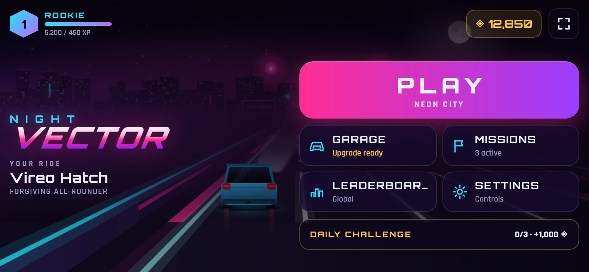
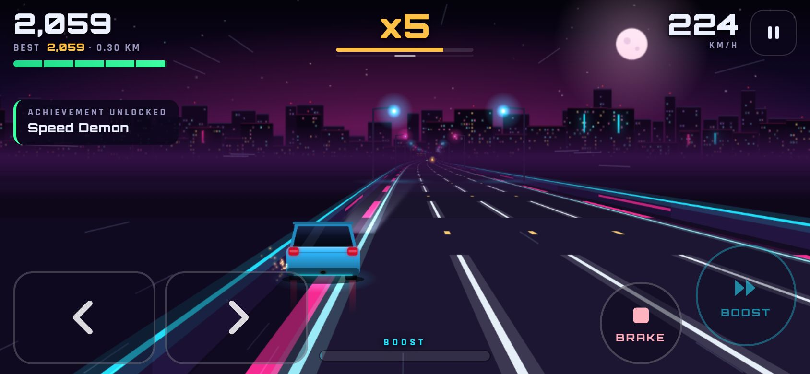
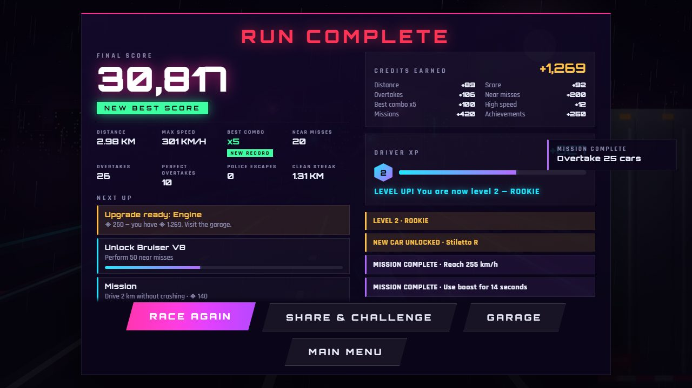
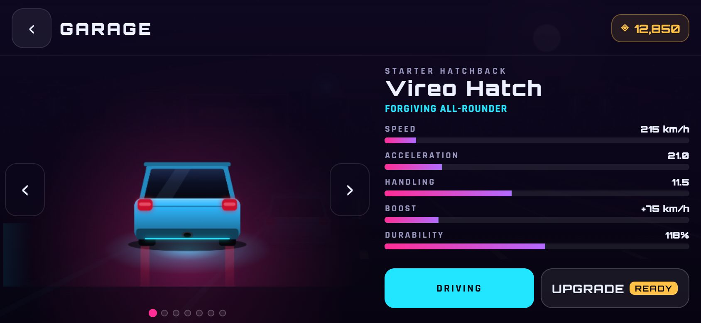

# Night Vector — Neon Highway Racer

*Thread the traffic. Own the night.*

A mobile arcade racer, played in landscape with both thumbs. Weave through traffic across five routes, chain risky moves into a combo multiplier, outrun the police, climb the global leaderboards and race your own best-run ghost. Runs last 1–5 minutes, and one tap starts the next. It installs to the home screen (PWA) and plays offline.

- **Built for phones:** touch-first controls (optional tilt steering), safe-area aware layout from 16:9 to 20:9, 30/60 FPS pacing, adaptive quality, haptics, and pausing on every interruption. Game controllers work too; the keyboard is kept only for development.

- **Client:** vanilla JavaScript (ES modules), HTML5 Canvas and Web Audio. No framework and no bundler. Every graphic and sound is generated procedurally; the one audio file is the police chase track (see [Police chase music](#police-chase-music)).
- **Server:** one small Node.js process with zero runtime dependencies. It serves the game and a JSON API, stores data in SQLite (`node:sqlite`), and runs in a single Docker container.
- **The game never needs the server.** Without it you still get the full game with local progress; only leaderboards and online profiles need a connection.

## Screenshots

Phone, 844×390 landscape:

| | |
|---|---|
|  |  |
|  |  |

## Quick start

Requires **Node.js 22.13+** (24 recommended).

```bash
npm install
```

```bash
npm run dev
```

Open http://localhost:8080, ideally in your browser's device mode (landscape phone). To try it on a real phone on the same Wi-Fi, open `http://<your-computer's-LAN-IP>:8080` (the server listens on all interfaces by default; allow port 8080 through the firewall). Plain `http://` on a LAN address isn't a secure context, so install, offline mode and tilt need an HTTPS deployment or tunnel; touch play works either way. Add `?debug` for the developer monitor (press **F**) and a `window.nightVector` console handle. Neither is ever available in production.

| Script | What it does |
|---|---|
| `npm run dev` | Server with auto-restart on server changes. The service worker is off in dev unless you add `?sw`, so edits are never hidden behind a cache. |
| `npm start` | Run the server (uses `dist/` in production if it exists, else `client/`). |
| `npm run build` | Release build into `dist/`: version check, copy, reference checks, `build-info.json`, size report. |
| `npm test` | Unit and API tests (`node:test`, in-memory database). |
| `npm run e2e` | Playwright end-to-end tests (desktop + phone profiles). First run: `npx playwright install chromium`. |
| `npm run lint` | ESLint. |
| `npm run stats` | Operator report: players, ranked/rejected races, runs, analytics events. |
| `npm run assets` | Regenerate the icons and the social preview image. |

## Controls

The car accelerates by itself; you steer, brake and boost.

| Action | Touch (default) | Tilt (optional) | Controller |
|---|---|---|---|
| Steer | hold the left or right half of the left pad; slide between them without lifting | turn the phone like a wheel | left stick / D-pad |
| Brake | BRAKE (right thumb) | BRAKE | LT / L2 |
| Boost | BOOST (right thumb, lights up when charged) | BOOST | A / Cross (or RB) |
| Pause | ❚❚ top right, or the phone's Back gesture | same | Start / Options |
| Menus | tap; swipe between cars in the garage | tap | D-pad / stick, A to select, B to go back |

- **Steering feel:** a quick tap nudges, a hold commits to a full lane change. Multi-touch works, so you can steer while braking or boosting.
- **Tilt:** chosen in Settings (the tap also asks iOS for motion permission). It calibrates at the start of every race and has a recenter button. Without a sensor, or if permission is refused, the game says so and keeps touch steering.
- **Interruptions:** switching apps, a call, locking the screen or turning the phone upright pauses the race and saves. Resuming runs a 3-2-1 countdown with the world frozen.
- **First race:** a short tutorial (steer, brake, near miss, boost) runs on the first race. It can be skipped and replayed from Settings, and it doesn't cost the run.
- **Keyboard (development only):** arrows/A-D steer, S brake, Space boost, P pause. It isn't shown anywhere in the UI.

### Settings

Steering (Touch / Tilt) · Sensitivity · Tilt recenter · Haptics · Graphics (Auto / Low / Medium / High) · Frame rate (Auto / 30 / 60) · Screen shake (Off / Low / Normal) · Audio · Music · Master / Music / Effects volume · Best-run ghost · Anonymous analytics · Replay tutorial · Reset progress.

## How to score

The loop: **drive fast → take risks → near miss / late dodge → combo → boost → go faster → bigger risks → more score and credits → upgrades and cars → next run.**

- **Combo (x1 → x2 → x3 → x5 → x8 → x10)** multiplies every point, including distance.
  - Risk builds it and keeps it alive: graded near misses, late-dodge perfect overtakes, chicanes, boosted passes and golden-car passes.
  - Plain overtakes add only a trickle and don't stop it decaying.
  - After 5 s without a risky move it drops one tier; a crash resets it.
- **Near misses** are graded by how close you pass: CLOSE +100, VERY CLOSE +250, INSANE +500. Each one also refills boost.
- **Perfect overtake** (+300): a car was directly in your path within 35 m, and you passed it within 1.2 s at speed.
- **Slipstream:** tuck in behind a car to charge boost and gain speed.
- **Perfect dodge** (+400, boost): swerve out of a car's path at the last moment. **Slingshot** (+250): pull out of a charged slipstream for a short surge above top speed.
- **FLOW** at x10: score ×1.25 and faster boost gain until the combo drops below x8.
- **Heat and the police** (below): heat is risk you can cash in — every heat star adds +10 % to all points.
- **Difficulty** follows racing time: a 30 s warm-up, then moderate → challenging → intense → expert by 6 minutes.

## Heat, police and the run director

- **Heat (0–5★)** builds from how you drive: running near top speed, boosting, a high combo, near misses (police near misses and blasting past a patrol most of all). It cools off quickly when you drive calmly. The HUD shows the stars and progress to the next one.
- **★1** is a warning. **From ★2** police units are dispatched from behind, in an adjacent lane, never on top of you, and they physically chase you: they close in, shadow you, and (★3+) overtake and try to block your lane with a telegraphed brake-check. **★4+** adds rams (warned first) and roadblocks; **★5** adds spike strips. Roadblocks are announced at 250 m and 150 m with a lane diagram and always leave at least one lane open.
- **Escape** by pulling away and passing units: the escape meter fills when no unit is close, faster the further ahead you are. You're **busted** if units stay on you while you're slow or you keep hitting them (−25 health, the run goes on). An escape pays score by stars (400 … 4,500) plus credits and XP per star, and earns a breather.
- **Run director:** each run is a sequence of phases (warm-up → pressure → event → escalation → peak → breather, repeating from a higher floor). An intensity value (0–100) drives traffic density, lane changes and designed formations (gates, staggers, truck walls, packs, moving gaps, risky pickups). A chase is always a peak; an escape is followed by a breather.
- **Events** (announced, never overlapping): heavy traffic, truck convoy, open highway, tunnel, roadwork, accident, rainstorm, police patrol, speed zone, overtake rush, near-miss blitz and a rival racer duel. Each run has a hidden seeded personality (mixed, traffic, police, speed, storm) that tilts which events appear, so runs don't play alike. If nothing happens for ~16 s the director makes something happen.
- **Crashes are graded:** a scrape costs a little speed and one combo tier; a side hit two tiers; a head-on hit ends the combo. Cones slow you and dent the car but don't end the run.
- **Dev panel** (`?debug`, never in production builds): trigger any heat level, a chase, roadblock, patrol, escape, every event and formation, and watch the director's phase, intensity, heat and telemetry.

## Police chase music

The chase has its own music state. The sequence: heat rises (a police radio squelch now and then at 1★, tenser music from 2★) → **POLICE DETECTED** (radio chirp) → a distant siren that grows as a unit closes in → the unit is **physically on screen** → the chase is on: a short stinger, the normal music fades out (0.6 s) while the chase track fades in (0.9 s) → higher heat opens the track's filter and brings in a second, faster siren → **escape**: the track keeps going for 1.4 s, fades over 2.2 s, a soft release cue plays and the normal music returns; **busted** fades faster; **wrecked** fades in 0.35 s, before the results screen.

- **Where the file goes:** put your licensed track in `client/audio/` (e.g. `client/audio/police-chase.mp3`) and set `file` in `client/js/data/audio.js`. The same block sets `startTime` (entry point, to skip an intro), `loopStart` / `loopEnd` (the section that loops while the chase goes on; `loopEnd` is the END of the playable section), `volume`, and every fade. Nothing else needs to change.
- **The file in the repository is an original placeholder** (`client/audio/police-chase-placeholder.wav`, generated by `tools/audio/make-chase-placeholder.mjs`: 1 bar of intro, then a 4-bar loop). No audio from any reference recording is included.
- **Playback:** one decoded `AudioBuffer`, at most one `AudioBufferSourceNode`, with Web Audio loop points: sample-accurate, no gap, never back to the intro. A new chase during a fade-out takes the same source back up instead of starting a second one.
- **Mix:** the chase track sits on the Music bus (Music volume); sirens and cues on the Effects bus; the engine has its own bus and is never ducked. Sirens follow the nearest unit's distance and sit a little under the chase music; a crash dips the music for a moment.
- **Loading:** the file downloads 2 s after startup (never blocking it), is decoded once when audio unlocks on the first tap, and is precached for offline play. If it's missing or can't be decoded, chases use the built-in synth music in chase mode.
- **Lifecycle:** pause and backgrounding suspend the whole AudioContext, so the track resumes from the same sample; a race stays paused and silent after returning, and the menu fades back in. `Game.onBackground()` / `Game.onForeground()` are the hooks a native shell (Capacitor) can call.
- **Dev panel** (`?debug`): heat 0–5, start / stop chase, escape, *Test chase music*, *Test escape transition*, and a live audio readout (state, track status, sources started, stingers).

## Progression and features

- **Driver profile:** the first launch asks for a driver name and an avatar — nothing else — then starts the first race. The profile is a guest profile saved on the phone; *Go online* (Profile) turns it into an online account.
- **Progression** ([docs/progression.md](docs/progression.md)): one rules engine for XP, levels, credits, car unlocks and purchases, upgrades, cosmetics, missions, the daily challenge and achievements, shared by the game and the server. All numbers live in `client/js/progression/config.js`, tuned with a simulation on recorded runs (`tools/balance`).
- **7 cars in 5 tiers** (Street → Sport → Performance → Supercar → Hypercar, plus a secret legendary car). Powerful cars need a driver level *and* a skill goal, then a credit price. Locked cars stay visible with their requirements and progress. Tier ceilings on upgrades keep each car's identity.
- **One currency** (credits) for cars, upgrades and cosmetics. Skill pays more than mileage; per-run caps stop one freak run from skipping the ladder.
- **After a race:** score, distance, best combo, top speed, a pursuit line (escapes, best heat escaped, longest chase, max heat), credits and XP, the level bar, *New unlock available* (with *View unlock*), one "try this next" hint and one concrete next goal.
- **World:** five routes plus a world tour, time of day, weather (rain, fog, storm), announced road events and rare surprises.
- **Online (optional):** cloud progress, validated runs, leaderboards (score / distance / top speed / combo × today / week / all time), and a one-time transfer code to continue on another phone.
- **Social:** Share & challenge from the results screen creates a link that shows your score as a challenge to whoever opens it.
- **Ghost:** a translucent replay of your personal best races alongside you (Settings → Best-run ghost).

## Architecture

A small monolith, on purpose:

```
┌──────────── browser ────────────┐        ┌──────────── node server (one process) ─────────────┐
│ index.html + ES modules (Canvas)│  HTTP  │ app.js: security headers → /health → /api/v1 → static│
│  Game loop (no network calls)   │◀──────▶│  static.js  in-memory cache, brotli/gzip, ETags       │
│  net/ApiClient  (timeouts, retry)│        │  api/       players · races · leaderboard · events    │
│  sw.js  offline precache        │        │  SQLite (WAL) on a volume  ·  JSON logs to stdout     │
└─────────────────────────────────┘        └───────────────────────────────────────────────────────┘
```

- **Game loop:** never touches the network.
  - API calls happen only from menus, at race start (a background session request that never blocks the countdown) and at run end.
  - Analytics batches go out on a timer or via `sendBeacon` when the page is hidden.
- **Offline-first:**
  - Progress lives in a versioned LocalStorage save; the server holds only ranked results and anonymous profiles.
  - Runs that finish offline are queued and submitted from the menus later.
- **Shared rules:** the server validates runs with the game's own `balance.js`, so validation bounds never drift from gameplay.

```
client/                 static PWA (served as-is in dev, copied to dist/ by the build)
  index.html  sw.js  manifest.webmanifest  og-image.jpg  icons/  fonts/  css/
  js/
    main.js boot.js       bootstrap + loading screen (boot.js is ES5 to show a message on old browsers)
    Game.js               state machine and loop
    balance.js config.js  gameplay balance · engine constants
    version.js env.js     version numbers · runtime config from <meta> tags
    AppShell.js pwa.js fullscreen.js   install, updates, fullscreen, connectivity, orientation
    InputManager.js TouchInput.js TiltInput.js GamepadInput.js FocusNav.js   touch/tilt/controller (+ dev keyboard) → one set of actions
    Performance.js        quality tiers, AUTO ladder, 30/60 FPS pacing
    Tutorial.js Haptics.js BackNav.js   first-race coach · vibration · Android Back handling
    Ghost.js Share.js     personal-best ghost · share text and challenge links
    net/                  ApiClient, PlayerService, RaceService, Analytics
    RunDirector.js        pacing: phases, intensity, run personality, event and formation choice
    EventDirector.js      runs road events and challenges
    PoliceSystem.js       heat, pursuit AI, roadblocks, escape/bust, rewards
    RivalRacer.js DevPanel.js   rival duel AI · dev-only event panel
    AudioManager.js Music.js ChaseMusic.js Signals.js   mixer + music state machine · synth music · chase track · event bus
    data/audio.js         chase track file, entry/loop points, fades, mix levels
    … Player, TrafficManager, SkillSystem, ScoreSystem, Road, Environment,
      Weather, Camera, Effects, Sprites, AudioManager, Music, SaveManager, Progression, Goals,
      Menus, MenuScreens, UIManager, data/
server/
  src/index.js            startup, graceful shutdown
  src/app.js              request pipeline, robots/sitemap
  src/config.js logger.js http.js security.js static.js precache.js htmlTransform.js
  src/api/                index (router, CORS, auth) · db (migrations) · players · names ·
                          races · raceRules (anti-cheat) · leaderboard · events · rateLimit
  scripts/stats.js        operator report
tools/                    build.mjs · generate-assets.mjs
tests/                    unit/ · api/ · e2e/ · helpers/
Dockerfile  docker-compose.yml  .env.example  .github/workflows/ci.yml
```

## API (`/api/v1`)

All responses are JSON. Errors always have the shape `{ "error": { "code", "message" } }`, never a stack trace. Authentication is `Authorization: Bearer <token>` (the device token returned when the account is created or recovered). Full design, sync and conflict rules: [docs/backend.md](docs/backend.md).

| Method | Path | Auth | Purpose |
|---|---|---|---|
| GET | `/status` | – | Version, server time, feature flags |
| POST | `/players` | – | Create an account `{displayName}` → `{player, token, progress, revision}` |
| GET · PATCH · DELETE | `/players/me` | ✓ | Profile · rename · delete account and everything tied to it |
| POST | `/auth/recovery-code` | ✓ | One-time transfer code for another phone |
| POST | `/auth/recover` | – | Redeem a transfer code → new device token + cloud progress |
| GET | `/progress` | ✓ | Canonical progression document + revision |
| POST | `/progress/import` | ✓ | One-time guest import (clamped) |
| POST | `/sync` | ✓ | Apply up to 60 operations in order (purchases, upgrades, cosmetics, races) → per-op results + document |
| GET | `/cars` | – | Car catalog: tiers, prices, requirements, upgrade ceilings |
| GET | `/garage` | ✓ | Owned / available / locked cars with requirement progress |
| POST | `/garage/purchase` · `/garage/upgrade` · `/garage/select` · `/garage/cosmetic` | ✓ | Single garage operations `{opId, …}` |
| GET | `/missions` · `/achievements` | ✓ | Missions, daily challenge, achievements |
| POST | `/races` | ✓ | Start a ranked session `{carId, envId, clientVersion}` (car must be owned) |
| POST | `/races/:id/finish` | ✓ | Finish it (the same validated race operation as `/sync`) |
| GET | `/leaderboard?category=&period=` | optional | Top 100. `category`: score, distance, speed or combo. `period`: day, week or all. |
| GET | `/leaderboard/me` | ✓ | Your rank on every board |
| POST | `/events` | – | Analytics batch (see Privacy) |

These endpoints sit outside `/api/v1`:

| Path | Purpose |
|---|---|
| `/health` | Always 200 while the process is serving; reports `database: ok \| unavailable` |
| `/robots.txt`, `/sitemap.xml` | Search engines. Production only; other environments send `noindex`. |

## Database (SQLite)

A real, file-backed SQLite database (`node:sqlite`, WAL mode, foreign keys on) on a Docker volume, with versioned migrations in `server/src/api/db.js` recorded in `schema_migrations`. Why SQLite rather than PostgreSQL, and how to move later: [docs/backend.md](docs/backend.md).

| Table | Holds |
|---|---|
| `players` | Account: stable id, public display name, timestamps, `flagged` (hidden from boards) |
| `auth_identities` | Sign-in credentials per account: device tokens and one-time transfer codes (SHA-256 only); email / Google / Apple reserved |
| `cars` | Canonical car catalog (tier, price, level, requirements, upgrade ceiling), synced from config at startup |
| `player_progress` | Credits (≥ 0), XP, level, selected car, missions and daily (JSON), revision |
| `player_stats` | Lifetime totals and personal records |
| `player_cars` · `player_cosmetics` · `player_achievements` | Owned cars with upgrade levels (0–5 each), bought cosmetics, unlocked achievements |
| `race_results` | Every settled run (online or offline): summary numbers, status, credits and XP paid |
| `race_sessions` · `scores` | Server-stamped ranked sessions and the leaderboard entries |
| `sync_ops` | Idempotency log: a retried operation is answered, never applied twice |
| `events` | Analytics. No IP, user agent or player id. 90-day retention. |

## Security

- **Headers:**
  - Strict CSP: `script-src 'self'`, no inline script, no eval, no third-party origins. The one `ld+json` block is inert data.
  - Also sent: `X-Content-Type-Options`, `X-Frame-Options: DENY`, `Referrer-Policy`, `Permissions-Policy`, COOP, and HSTS in production over HTTPS.
- **Input handling:**
  - JSON only, with body size caps (4 KB, or 16 KB for analytics) and a content-type check.
  - Every field is validated for type and range; all SQL uses prepared statements.
  - Display names: 3–16 characters from `[A-Za-z0-9 _-]`, with reserved-name and profanity screening.
  - Leaderboards never expose player ids.
- **Static files:** path traversal and dotfiles are blocked; server source and data are never served.
- **Rate limiting:** in-memory token buckets.
  - A global per-IP limit, plus stricter limits on profile creation, renames, race start/finish, leaderboard reads and analytics.
  - Memory is bounded. `TRUST_PROXY` controls whether `X-Forwarded-For` is honoured.
- **CORS:** off unless `CORS_ORIGINS` lists allowed origins (only needed for a separate API domain).
- **Logs:** JSON lines in production. They never include tokens, request bodies, query strings or names, and 5xx errors are logged without stack traces in production.
- **Abuse tests:** `tests/api/security.test.js` covers traversal, SQL injection, markup in names, prototype pollution, forged tokens, floods, deeply nested JSON and information leaks.

### Anti-cheat: what it does and doesn't do

The browser is untrusted. The server never takes a client number at face value; each submitted run is checked against its session:

- **Wall clock:** race time can't exceed the real time that passed since the server opened the session. This defeats speed hacks and "fast-forwarded" runs.
- **Top speed:** at most that car's absolute ceiling (full upgrades, difficulty bonus, slipstream and boost), from the shared balance data.
- **Distance:** at most top speed × time. It must also be consistent with the reported top speed.
- **Actions:** near-miss and overtake counts are bounded by how much traffic the road can spawn over that distance. Perfect overtakes can't outnumber overtakes.
- **Score:** at most the theoretical maximum for that distance and those actions.
- **Combo:** must be a real tier (x1/2/3/5/8/10), and there must have been enough actions to reach it.
- **Sessions:** single use, one live session per player, 3-hour expiry. Re-sending the same result is idempotent; a different one is rejected as a replay.
- **Rejections:** the client only hears "could not be verified". The specific reason goes to the server log and to `npm run stats`.

**Limits.** A modified client that plays in real time with plausible numbers can still post a score. For example, an invulnerable car driving for 9 minutes produces believable figures. Stopping that needs server-side simulation or replay verification, which would be a much bigger system. Mitigations available today:

- Flag the player in the database (`UPDATE players SET flagged = 1 …`) to hide them from every board.
- Watch the rejection counters and top runs in `npm run stats`.

## Privacy

- **No accounts, emails or passwords.** An online profile is just a racer name plus a random token stored on the device. **Profile → Delete online profile** erases it and all its runs from the server.
- **Leaderboards** show only the racer name, the value, the car and the date.
- **Challenge links** contain only the racer name, score, distance and route. They are not signed: a tampered link can only change a target for whoever opens it, and ranked scores come only from verified runs.
- **Analytics:**
  - What's sent: whitelisted events (e.g. `race_end` with rounded km and score-in-thousands, `car_unlocked`, `upgrade_bought`) tied to a random per-install id that is not linked to the profile.
  - What's never sent or stored: IP addresses, user agents, names or free text.
  - Timing: batched every 30 s, never per frame.
  - Turning it off: Settings → Privacy, automatically with Do Not Track / Global Privacy Control, or `ANALYTICS_ENABLED=false` on the server (clients then stop sending).
- **Fonts** are self-hosted, so there are no third-party requests at all.

## PWA and offline

- **Install:** the manifest (icons including maskable, a phone screenshot) opens the game fullscreen in landscape. An in-game **Install** button appears when the browser offers it; the iOS hint is Share → Add to Home Screen. In the browser, the first PLAY tap also goes fullscreen.
- **Service worker:**
  - Precaches everything the game needs; the cache name comes from a content hash that the server computes.
  - Cache-first for assets; navigations are answered from the cached shell. `/api` and `/health` are never cached.
- **Updates never interrupt a race.** A new version downloads in the background. The "New version available" banner appears only in menus or on the results screen, and the reload happens only when the player accepts.
- **Offline:** the full game works, including saves, missions, the daily challenge, the ghost and challenges. The topbar shows **OFFLINE** (no network) or **LOCAL ONLY** (server unreachable).
- **Back button:** during a race or on a sub-screen, Android's Back pauses or goes back instead of leaving the game.

## Configuration

Copy `.env.example` to `.env` for local overrides. Real environment variables always win.

| Variable | Default | Purpose |
|---|---|---|
| `APP_ENV` | `development` | development / staging / production / test (falls back to `NODE_ENV`) |
| `HOST` / `PORT` | `0.0.0.0` / `8080` | Listen address |
| `PUBLIC_URL` | – | Public origin for canonical, Open Graph, sitemap and JSON-LD. Set it in production. |
| `API_URL` | – | Only if the API is on another origin (also add it to `CORS_ORIGINS`) |
| `CORS_ORIGINS` | – | Comma-separated allowed origins |
| `DATABASE_PATH` | `data/nightvector.db` | SQLite file (`:memory:` for tests) |
| `TRUST_PROXY` | `false` | Honour `X-Forwarded-For` (only behind a proxy you control) |
| `ANALYTICS_ENABLED` | `true` | Server-side analytics switch |
| `RATE_LIMIT_SCALE` | `1` | Multiply all rate limits (load tests, E2E) |
| `STATIC_DIR` | auto | Override the static directory |
| `LOG_LEVEL` | `info` in prod, `debug` in dev | debug / info / warn / error |

No secrets are required: player tokens are random and stored hashed, and sessions are database records.

## Deployment

```bash
docker compose up -d --build
```

The image:

- **Base:** `node:24-alpine`; the build stage produces `dist/`.
- **Runtime:** runs as the non-root `node` user with no npm dependencies. The data volume is at `/data`, and the container can run with a read-only root filesystem (compose does this).
- **Health:** a `HEALTHCHECK` polls `/health`.
- **Shutdown:** on SIGTERM the server stops accepting connections, finishes in-flight requests, closes the database, and exits within 10 s.
- **Verified:** the image was built from a fresh clone (59 MB, about 12 s) and ran with a read-only root filesystem. It became healthy in about 8 s, served the game and API, and `docker stop` exited 0. Players and leaderboard entries survived a container restart.

Without Docker, on any host with Node 22.13+:

```bash
npm ci --omit=dev
```

```bash
npm run build
```

```bash
APP_ENV=production PUBLIC_URL=https://your.domain DATABASE_PATH=/var/lib/nightvector/nightvector.db npm start
```

Put a TLS-terminating reverse proxy in front (Caddy, nginx or a platform load balancer), set `PUBLIC_URL=https://…` and `TRUST_PROXY=true`, and back up the `/data` volume. SQLite in WAL mode can be backed up live with `sqlite3 nightvector.db ".backup backup.db"`.

**Scaling:** one instance comfortably serves a small-to-medium player base, since the game is static and the API is tiny. Running several instances would need the database and rate limiter moved to shared services; that is intentionally out of scope.

## Mobile Development (Android / iOS)

One game, three shells. The web game in `client/` is the only game code; Capacitor wraps a build of it in native Android and iOS apps.

```
client/ (the game) ──npm run build──────► dist/      → Node server → web / PWA
                   └─npm run build:app──► dist-app/  → npx cap sync → android/ · ios/
```

- **App ID:** `io.github.nvx12.nightvector` (Android package and iOS bundle ID), display name **Night Vector**. This ID is permanent once the app is published: don't change it.
- **Version:** taken from `package.json` (`1.2.0`). Android `versionCode` is derived from it (MAJOR×10000 + MINOR×100 + PATCH → `10200`); iOS uses the same marketing version and build number. Bump `package.json` for each store release.
- **Native layer:** `client/js/native.js` (the only code that talks to Capacitor, through the injected `window.Capacitor` bridge; a no-op in browsers) and `client/js/NativeShell.js` (app pause/resume, hardware Back, network status, splash). Only events cross the bridge; nothing per frame.

### Requirements

| | Version used for this migration |
|---|---|
| Node | 22.13+ (24.15 used); npm 11 |
| Capacitor | 8.5.2 (`@capacitor/core`, `cli`, `android`, `ios`) |
| Plugins | `@capacitor/app` 8.1.1 · `haptics` 8.0.2 · `network` 8.0.1 · `preferences` 8.0.1 · `splash-screen` 8.0.2 |
| JDK | 21 (Eclipse Temurin 21.0.12 used). Android Studio's bundled JBR also works. |
| Android | Android Studio (latest) or the SDK: platform 36, build-tools 35 (Gradle installs missing SDK parts on first build). Gradle 8.14.3 via the wrapper. minSdk 24 · targetSdk 36. |
| iOS | macOS with Xcode 16+ (iOS 15+ deployment target). Swift Package Manager (no CocoaPods). |

### Commands

| Task | Command |
|---|---|
| Web development (unchanged) | `npm run dev` → http://localhost:8080 |
| Web/PWA production build | `npm run build` → `dist/` |
| Native web build | `npm run build:app` → `dist-app/` |
| Native build + sync both platforms | `npm run mobile` |
| Open in Android Studio | `npm run android` |
| **Debug APK** | `npm run android:apk` → `android/app/build/outputs/apk/debug/app-debug.apk` |
| **Release AAB** (Google Play) | `npm run android:aab` → `android/app/build/outputs/bundle/release/app-release.aab` |
| Open in Xcode (macOS) | `npm run ios` |
| Regenerate icons and splash | `npm run assets:native` |

`android:apk` / `android:aab` run `tools/android.mjs`, which finds a JDK 21 and the Android SDK on its own (no global `JAVA_HOME` change needed) and prints the exact output path.

**Everyday workflow:** edit `client/` → `npm run android:apk` (or `npm run mobile` and press Run in Android Studio). Never edit `android/app/src/main/assets/public` or `ios/App/App/public`: they are generated copies.

### Environment (public build-time values)

The server fills the web HTML at request time; the app has no server, so `npm run build:app` bakes these in. **Everything in the app is public — never put secrets here.**

| Variable | Default | Meaning |
|---|---|---|
| `NV_APP_ENV` | `production` | `development` · `staging` · `production`. Debug tools exist only in non-production builds opened with `?debug` (not reachable in a bundled app). |
| `NV_API_URL` | *(empty)* | Backend origin, e.g. `https://api.example.com`. Empty = the app plays fully offline (local profile and progress, LOCAL ONLY chip, no network calls). |
| `NV_PUBLIC_URL` | *(empty)* | Public web address of the game, for share links. Empty = shares send text only. |

Staging/production builds refuse `http://` and local addresses (`localhost`, `127.*`, `10.*`, `192.168.*` …): on a phone, `localhost` is the phone. Example: `NV_API_URL=https://api.example.com NV_PUBLIC_URL=https://play.example.com npm run android:aab`.

When the app should reach your server, add the app origins to the server's `CORS_ORIGINS`: `https://localhost` (Android) and `capacitor://localhost` (iOS).

**Live reload (development only, not yet tried on a device):** start `npm run dev`, then `npx cap run android --live-reload --host <your PC's LAN IP> --port 8080`. The CLI points the installed app at your dev server for that run only; `capacitor.config.json` never contains a server URL, so release builds always load the bundled files.

### Release signing (Android)

Never commit keys or passwords (`*.jks`, `*.keystore`, `keystore.properties` are git-ignored).

1. Create an upload key once, keep it and its passwords safe (a password manager), and back it up:
   `keytool -genkeypair -v -keystore night-vector-upload.jks -alias upload -keyalg RSA -keysize 2048 -validity 10000`
2. Either create `android/keystore.properties` (git-ignored):
   ```
   storeFile=../night-vector-upload.jks
   storePassword=…
   keyAlias=upload
   keyPassword=…
   ```
   or set `NV_KEYSTORE_FILE`, `NV_KEYSTORE_PASSWORD`, `NV_KEY_ALIAS`, `NV_KEY_PASSWORD` in the shell / CI secrets.
3. `npm run android:aab`. Without signing configured the AAB is built unsigned. Use **Play App Signing**: Google keeps the app signing key, you keep only the upload key.

### iOS

Prepared, not yet built: it needs macOS + Xcode. On a Mac: `npm ci`, `npm run ios`, select your team under *Signing & Capabilities*, run on a device. Configured: bundle ID, display name, landscape-only (iPhone and iPad, full screen), hidden status bar, version 1.2.0 (10200), icon and splash. Untested until then: audio session behaviour (Web Audio follows the silent switch), safe areas around the Dynamic Island in landscape, home-indicator gestures near the bottom touch pads, interruption handling (calls).

### How the app behaves

- **Lifecycle:** app sent to background → the race pauses, all audio (music, engine, sirens, chase track) is suspended in place, the save is written. Coming back shows **PAUSED** and waits for **RESUME** — never straight back into traffic. The frame clock is reset on return and every frame step is capped, so physics never jumps.
- **Back key:** racing → pause · paused → resume (with the usual countdown) · sub-menu → previous menu · results → menu · home → the app goes to the background (Android convention).
- **Screen:** landscape only, immersive (status and navigation bars hidden; swipe from an edge to show them briefly), drawn into the camera cutout with the HUD kept clear by the safe-area insets. Dark splash with the logo, no white flash.
- **Haptics:** the game's existing pulses (near miss, boost, hit, crash, unlock) through the OS haptics engine, one call per event, honouring Settings → Haptics.
- **Storage:** the same save (`client/js/storage.js`), mirrored to the OS key-value store and restored at startup if the WebView storage was cleared. App updates keep progress (same origin `https://localhost` — never change the app's scheme/hostname).
- **No service worker** in the app: the files are in the app package already.
- **Permissions:** `INTERNET`, `VIBRATE`, `ACCESS_NETWORK_STATE` — all install-time, no prompts. No cleartext HTTP.

### Troubleshooting (problems met during the migration)

- **`JAVA_HOME` points to a JDK that doesn't exist / no JDK 21:** install Temurin 21 (a per-user ZIP works without admin rights) or use Android Studio's JBR; `tools/android.mjs` finds both.
- **Gradle: `Unable to establish loopback connection`:** JDK 16+ on Windows uses AF_UNIX sockets in the temp folder; on some machines (security/filter software) they fail under `AppData`. `tools/android.mjs` moves them to `%USERPROFILE%\.gradle\nv-uds`. In Android Studio, add `-Djdk.net.unixdomain.tmpdir=C:\Users\<you>\.gradle\nv-uds` to *Help → Edit Custom VM Options* and to `org.gradle.jvmargs` in your user `~/.gradle/gradle.properties`.
- **`capacitor-assets` tries to write `www/manifest.json`:** only Android/iOS are generated (`--android --ios`); the PWA icons come from `npm run assets`. Use `npm run assets:native`, which also keeps the adaptive icon free of the tool's default 16.7 % inset.
- **XML resource error at `colors.xml`:** `--` is not allowed inside XML comments.

## Testing and CI

| Suite | Command | Covers |
|---|---|---|
| Unit | `npm test` | Scoring and combo, the progression engine (XP curve, car requirements and purchases, upgrade ceilings and level gates, cosmetics, run rewards and caps, settlement, unlock announcements, next goal, document repair), seeded missions, daily challenge, achievements, save v3 and the v1/v2 migrations, driver profiles, anti-cheat rules, challenge links, ghost, and a balancing-simulation guard on the progression targets |
| API | `npm test` | Accounts, names, auth, body limits, rate limits, CORS, sessions, idempotency, replay, expiry, validation, leaderboards, erasure, analytics, security abuse cases, robots/sitemap; cloud progression: server-paid races (once), offline time budget, purchases (locked, broke, success, duplicate), upgrades (ceiling, level gate, ownership), forged prices/credits/levels, malformed operations, impossible runs, mission rewards, guest import clamps, transfer codes, catalog/garage endpoints, database constraints, upgrading a real v2 database file |
| E2E | `npm run e2e` | First launch (create driver → first race with the tutorial), home navigation, one-tap PLAY → race → results with rewards and next goal → restart, bonus feed stays off the road (≤ 3 lines), pause and resume countdown, garage requirements and the secret car, going online and the leaderboard, security headers, offline play via the service worker, challenge links, controller navigation and driving, frame-time budget. Phone and desktop profiles. |
| Balancing | `node tools/balance/sample-runs.mjs` · `node tools/balance/simulate.mjs` | Records bot runs through the real game, then simulates progression from a new profile for casual / skilled / expert players (see docs/progression.md) |

**CI** (`.github/workflows/ci.yml`) runs lint → unit/API → build → E2E. It then builds the Docker image, waits for the container to become healthy, and checks that `docker stop` exits cleanly.

## Performance

- **No per-frame allocations** in hot paths: traffic, pickups, particles, rain and floating text all use pools or typed arrays.
- **Batched rendering:** each road layer is one batched path fill; sprites and backdrops are pre-rendered and cached.
- **HUD:** updates 15 times a second and only writes values that changed.
- **Quality tiers** change cosmetics only (effects detail, particle budget, pixel density); gameplay is identical on every tier.

  | Tier | Max density | Pixel budget | Particles |
  |---|---|---|---|
  | Low | 1× | 0.5 MP | 140 |
  | Medium | 1.5× | 1.0 MP | 300 |
  | High | 2× | 1.7 MP | 520 |

- **Auto** picks a tier from the CPU core count and device memory (never the user-agent string). It then steps down on sustained slow frames: next tier, then 85% and 75% render scale, then 30 FPS. It steps back up carefully when there's headroom and remembers what it learned. Manual tiers only fall back to 30 FPS if 60 is clearly out of reach.
- **Battery and heat:** menus render at 30 FPS, 120 Hz screens are capped at 60, and nothing runs while the page is hidden.
- **Measured** on a phone viewport (844×390 @3×) in Chromium with the CPU throttled to emulate a mid-range (4×) and a low-end (6×) phone, in the worst case (heavy traffic, a police chase, a storm and continuous boost):

  | CPU | Auto | Low | Medium | High | Render CPU / frame |
  |---|---|---|---|---|---|
  | 4× slower | 56–58 FPS | 60 | 59 | 57.5 | 4.5 ms |
  | 6× slower | ~53 FPS (Low, reduced scale) | 30 (stable) | 30 | 30 | 5.7 ms |

- **Stability:** 20 play → crash → restart cycles on a phone viewport kept the heap at 3.4–4.0 MB, with 79 listeners, about 880 DOM nodes, one AudioContext, one interval and a steady 60 rAF/s.
- **Worst case with the pursuit systems** (5★ chase with 3 units + storm + heavy traffic of ~23 cars + continuous boost + ~56 particles, 844×390 @3×): 60 FPS with CPU ×1 and ×4; update + render 0.6 ms (×1) and 6.7 ms (×4) per frame, vs 3.1 ms for a plain race at ×4.
- **Session length:** bot players (`tools/balance/playtest.mjs`) on the default car had median runs of 95 s (casual), 89–95 s (skilled) and 110–145 s (expert).
- **Payload:** what a phone downloads and caches to play is about 370 KB gzipped (brotli is smaller). The whole release is 549 KB; the rest is the social preview and install-sheet JPEGs, which are fetched only when needed. The police chase track is cached on top of that (the placeholder WAV is 268 KB; a 30–60 s MP3 at 128 kbps would be about 0.5–1 MB), downloaded 2 s after startup. The Docker image is 60 MB.

## Known limitations

- **Chase music uses an original placeholder** until a licensed track is placed in `client/audio/` (see [Police chase music](#police-chase-music)). On iPhone, Web Audio follows the ring/silent switch (silent = no game audio in Safari); a native shell can set the audio session to play regardless.
- **The native Android app has not yet been run on a phone or emulator** (none was connected during the migration); its lifecycle, Back key, network, haptics and storage paths were tested against the real app bundle with a simulated Capacitor bridge. The iOS project is prepared but not built (needs macOS).
- Safari/iOS and Firefox are untested. Known iOS gaps: no Fullscreen API on iPhone (use Add to Home Screen), no `navigator.vibrate` (haptics show "Not supported"), and orientation can't be locked from the web.
- The road is flat (no hills), and all traffic drives in your direction.
- Anti-cheat can't detect a modified client that plays in real time with believable numbers (see above).
- Display-name screening is a short word list, not full moderation; the `flagged` column is the manual tool.
- The server is single-instance: rate limits live in memory, and SQLite runs on one volume (see docs/backend.md for the PostgreSQL path). `node:sqlite` is still marked experimental in Node 24.
- Pacing, heat and police were tuned on bot playtests, not people. The director's numbers (`DIRECTOR`, `HEAT`, `POLICE` in `balance.js`) need a real playtest pass.
- Progression was balanced on bot runs, not people. Bots crash sooner in the fastest cars, so the simulated skill advantage late in the ladder is probably understated; re-check with real beta data.
- Accounts have device tokens and one-time transfer codes only; email / Google / Apple sign-in is designed for (`auth_identities`) but not built. Losing the phone without a transfer code loses the account.
- A guest's progress can't be verified, so going online imports it with limits (level 12, 20,000 credits, upgrade step 3).
- Up to 60 changes can wait offline for sync; beyond that the oldest are dropped from the queue (the local game keeps them until the next cloud copy replaces it).

## Licenses

- Fonts: Orbitron and Rajdhani, SIL Open Font License 1.1 (`client/fonts/OFL-*.txt`).
- Everything else is original to this project.
